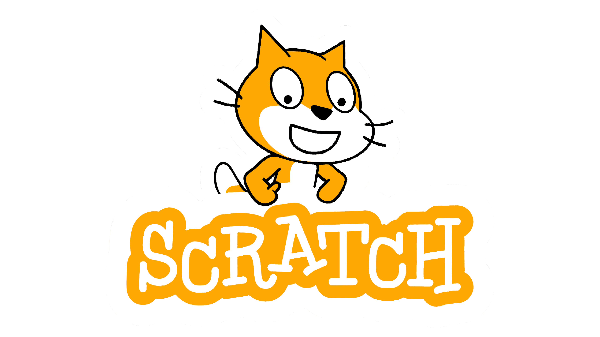

*Software engineering: a craft where creativity meets logic and determination.*

My journey in programming began at the age of 11, experimenting with Scratch, a block-based programming language that introduced me to foundational concepts of logic and structure. Despite its limitations, Scratch was instrumental in fostering my curiosity and teaching me the value of experimentation and iteration. As I moved beyond Scratch, I was drawn to explore more powerful tools and languages, eventually stumbling upon C. However, transitioning from block-based to procedural programming was a significant challenge, revealing the vast gulf between intuitive visual interfaces and the more abstract world of text-based programming. This challenge, though frustrating at first, taught me the importance of methodical learning and persistence. Looking back, my early experiences with Scratch and C laid a strong foundation for my current interests in software engineering, particularly in areas that require creative problem-solving and an eagerness to push boundaries.

## Broadening my skillset

Looking ahead, I am eager to deepen my expertise in areas like optimization techniques, software verification, and the practical application of mathematical concepts in computing. Mastering optimization is particularly exciting to me because it combines algorithmic problem-solving with a deep understanding of data structures and computational constraints. Additionally, I aspire to gain proficiency in a wider range of programming languages, such as JavaScript and TypeScript, which I have recently begun exploring. These languages have already shown me how diverse tools can offer unique solutions to problems, underscoring the importance of adaptability and a growth mindset in the software engineering field. My ultimate goal is to be versatile enough to pick up any language or framework and apply it effectively to solve complex problems.

## Bridging technical and soft skills

In the future, I aim to cultivate a blend of technical and soft skills that will enable me to thrive in collaborative, multidisciplinary environments. Additionally, I hope to explore more advanced topics in robotics to enhance the real-world applicability of my work. By continuously building on my foundation in programming, mathematics, and problem-solving, I aspire to make meaningful contributions to the field of software engineering, particularly in projects that require innovation and interdisciplinary collaboration.

*ChatGPT used for grammar and word choice*
