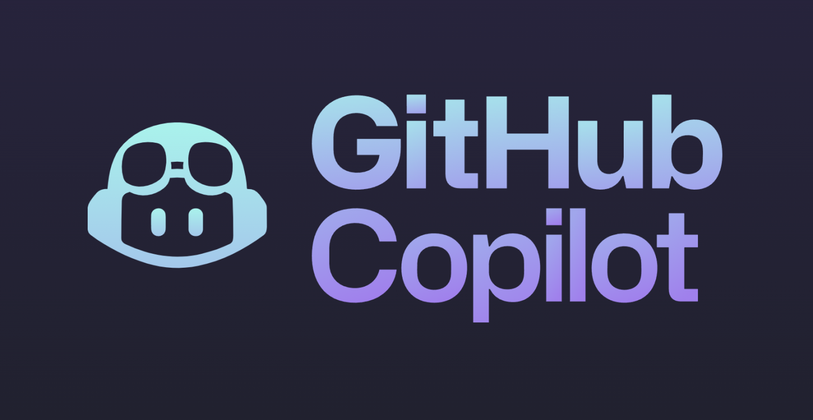

# Bittersweet Love Story with AI

## Introduction

During my time in ICS 314, Software Engineering at the University of Hawai‘i at Mānoa, I utilized AI tools such as ChatGPT and GitHub Co-Pilot to complement my learning. These tools became part of my everyday workflow, sometimes as a brainstorming partner, other times as a debugging assistant. This essay explores how these technologies impacted my coursework, my comprehension of software engineering principles, and the broader implications of integrating AI into education.

## Personal Experience with AI

### Experience WODs

In the Experience WODs, I found that using AI wasn't very effective. These tasks required an in-depth understanding of how the code fit into a broader application, and AI lacked the context to generate meaningful responses. For example, when I asked ChatGPT, "How do I structure this app using the WOD instructions?" it gave a generic answer that didn’t match the specific requirements. In these scenarios, thinking through the problem myself led to a better outcome and stronger learning.

### In-class Practice WODs

In contrast, AI was more useful in the Practice WODs. Since I had already become familiar with the instructions and framework by this point, using ChatGPT to confirm syntax or debug functions was beneficial.

### In-class WODs

Time constraints made AI extremely valuable during these exercises. AI saved time, though sometimes the code required minor fixes. Overall, the AI helped reduce cognitive load and let me focus on integration rather than syntax.

### Essays

AI was highly effective for writing essays. I found it helpful to draft rough ideas and then ask ChatGPT to polish them or help with transitions. I would paste paragraphs into ChatGPT and prompt, “Can you improve the clarity and structure of this?” The result was a much more coherent and articulate piece. It allowed me to focus on content while AI supported the editing process.

### Final Project

The final project exposed the limitations of AI. Our project required deep contextual knowledge and intricate debugging. ChatGPT was useful for quick explanations (e.g., “What does this error mean?”) and small fixes, but not for writing actual project code. Copilot sometimes suggested incorrect imports or failed to understand our folder structure. It became clear that AI couldn't replace a comprehensive understanding of the system.

### Learning a Concept / Tutorial

AI truly shined here. I used ChatGPT to explain topics like when we were first introduced to React Bootstrap. I would ask, “Explain how React Bootstrap differs from Bootstrap with examples,” and receive a clear, digestible answer. It was like having a personal tutor available at all hours.

### Answering a Question in Class or on Discord
AI was not helpful in this area. Class discussions and Discord threads are often grounded in shared class context, including specific assignments or bugs. ChatGPT lacked this context, so answers felt off-target or overly generic.

### Asking or Answering a Smart-Question
Similarly, smart-questions typically stem from project-specific bugs. AI could only speculate becuase it offered standard suggestions, but help from classmates on Discord often pinpointed the issue faster.

### Coding Example

This is one of AI’s strengths. It provided clear, concise examples when prompted with, It was mainly useful for both studying and reviewing material.

### Explaining Code

AI was excellent here. I could paste code and ask, “Explain what this function does, line-by-line,” and ChatGPT would generate annotations that clarified each part. This helped me understand unfamiliar code and prepare for code reviews.

### Writing Code

When writing short functions, Copilot and ChatGPT were useful for auto-completing repetitive patterns or generating boilerplate code. But for complex logic or code that fits into the codebase, human understanding remained essential.

### Documenting Code

AI was helpful here as well. I asked ChatGPT, “Add comments to this React function,” and it produced documentation that was accurate and helpful. This made it easier to maintain readable, professional-quality code.

### Quality Assurance

AI had mixed success in this area. For ESLint errors, it was often useful as ChatGPT could suggest corrected syntax when prompted with, “Fix ESLint error in this code block.” However, for deeper logic bugs, AI could misinterpret the problem or provide irrelevant suggestions.

### JSON Formatting

AI was very useful for converting arbitrary data from text into valid JSON format. This was difficult, but with some prompt engineering (some organized prompts from the internet), it was possible and much faster than manually typing it.

## Impact on Learning and Understanding

Using AI tools significantly improved my comprehension of software engineering principles by accelerating feedback loops. I could get instant clarification on concepts I struggled with, which helped reinforce classroom instruction. However, the biggest value came from using AI as a complement, not a replacement. It supported problem-solving without doing the thinking for me.

## Practical Applications

Outside ICS 314, I’ve used AI in real-world robotics projects with ROS. For example, I asked ChatGPT, “How do I publish a sensor message in ROS2 Python?” and got a great working example. It helped speed up prototyping and supported documentation efforts. While AI doesn't understand the full complexity of hardware integration, it serves as a strong starting point for many development tasks.

## Challenges and Opportunities

One of the main challenges is the lack of context. AI often struggles with specific project scopes or unconventional bugs. Another limitation is accuracy as AI can hallucinate APIs  outdated syntax. On the opportunity side, AI could be integrated into the curriculum more deeply through guided prompts, in-app debugging, or sandbox AI coding environments that are context-aware.

## Comparative Analysis

Compared to traditional learning methods, AI-enhanced approaches offer speed and convenience. Instead of poring over documentation, I can get concise summaries tailored to my questions. However, traditional methods foster deeper understanding and problem-solving resilience. Combining both methods self-discovery followed by AI confirmation was the most effective strategy for me.

## Future Considerations

Looking forward, I expect AI to play an even more integral role in software engineering education. With advancements in contextual understanding and code awareness, AI may one day be able to act like a real-time pair programmer. Still, ethics, overreliance, and accuracy will remain critical considerations.

## Conclusion

My experience with AI in ICS 314 was largely positive and enlightening. Tools like ChatGPT and Copilot supported my growth as a developer, especially in terms of understanding, debugging, and documentation. However, they couldn’t replace the value of deep learning, human feedback, and project-specific knowledge. My recommendation is to treat AI as a supportive teammate, useful, but not infallible, and continue to emphasize foundational knowledge in software engineering education.

*This essay was grammar checked with ChatGPT.*