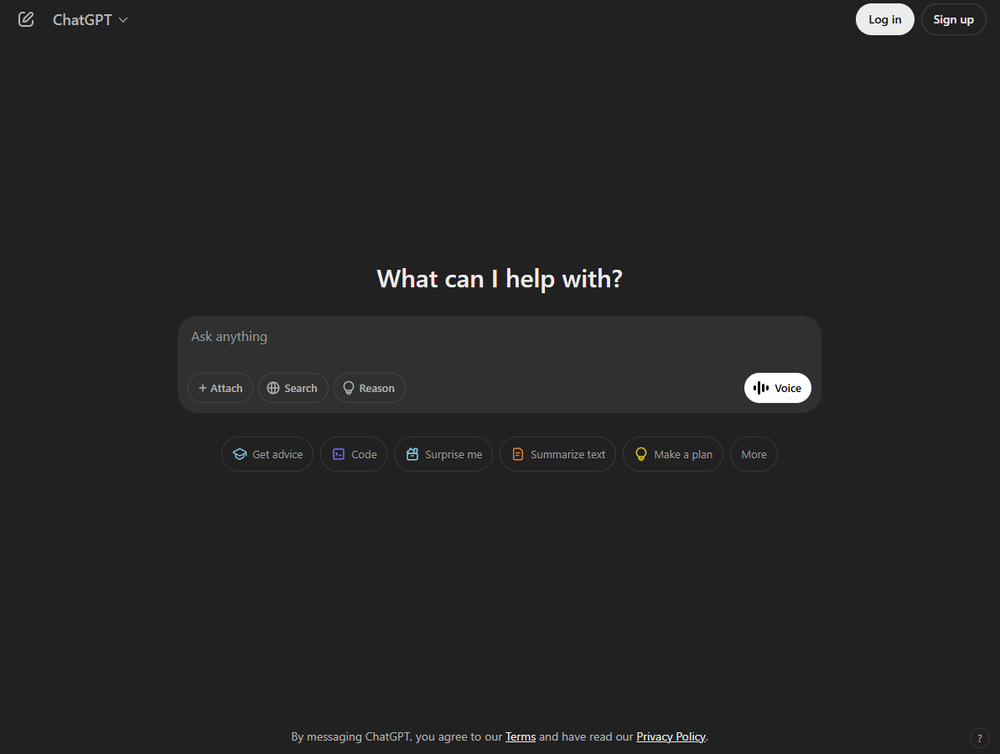
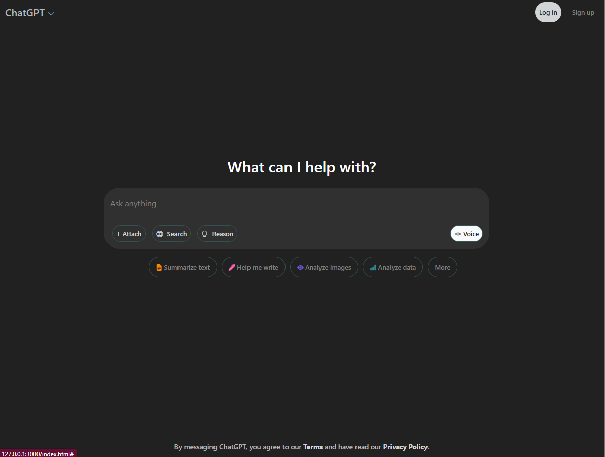

### Bootstrap: A UI Framework Setting Standards

UI frameworks are not simple. In many ways, learning a framework like Bootstrap 5 can feel as complex as learning a new programming language. Given the effort required, one might wonder—why bother? Why not just use raw HTML and CSS? The answer lies in the software engineering benefits these frameworks provide, such as efficiency, consistency, and ease of maintenance.

From my own experience, Bootstrap has been a game-changer in web development. Before using it, I struggled with designing modern-looking websites. Even with a solid understanding of HTML and CSS, achieving a polished, professional look required significant effort. However, Bootstrap simplifies this process by providing pre-built styles and a structured grid system that ensures a sleek and clean design with minimal customization.

One of the most useful aspects of Bootstrap is its flexible layout system, which relies on rows, columns, and various utility classes. This structure makes it easy to create grid-based layouts without manually handling complex CSS rules. For example, in one of my projects, I attempted to recreate the ChatGPT website's layout. Surprisingly, replicating the general structure and styling was straightforward thanks to Bootstrap’s built-in classes. However, fine-tuning elements—especially interactive ones—proved to be more challenging.

The biggest difficulty I encountered was positioning the text box and buttons exactly as they appear on the original ChatGPT site. While Bootstrap's responsive design tools helped, I found that resizing the screen often caused misalignment issues. Buttons would shift unpredictably, and their sizes did not scale as expected. This experience highlighted an important lesson: even with a framework like Bootstrap, achieving pixel-perfect design requires careful attention to responsive behavior and viewport dimensions.

*The original ChatGPT website*

*My ChatGPT remake*

Another challenge I faced was modifying Bootstrap’s default styles. Initially, I tried editing the framework’s built-in CSS classes directly—a major mistake. Overriding Bootstrap’s core styles led to unintended consequences, breaking the consistency of my layout and forcing me to restart multiple times. From that experience, I learned a valuable rule: **never modify Bootstrap’s default classes**. Instead, it's best to create custom styles that complement the existing framework rather than override its core functionality.

Despite these challenges, I found Bootstrap to be an incredibly useful tool. It provides a standardized, well-structured design system that simplifies web development. Instead of spending hours debugging raw HTML and CSS, Bootstrap allows developers to focus on functionality and user experience. Additionally, its structured class-based approach makes code more readable and maintainable, ensuring that revisiting a project months later doesn’t feel like deciphering a cryptic puzzle.

Overall, my experience with Bootstrap has been overwhelmingly positive. While it has a learning curve, the benefits far outweigh the initial frustration. By leveraging its powerful tools and following best practices, developers can create visually appealing, responsive websites with minimal effort. If you’re considering using a UI framework, I highly recommend giving Bootstrap a try—you may find, as I did, that it significantly enhances both your workflow and your final product.

*This essay was grammar-checked with ChatGPT.*
