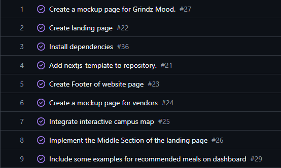

# The Importance of Estimating

## The Benefits

Effort estimation was a critical component of our development process for Da-Grindz, a vendor-focused web application designed to help students and community members around the UH Mānoa campus discover and plan meals. We used GitHub Project boards to organize issues across three milestones and included custom fields such as estimated effort, coding effort, non-coding effort, estimator, and implementors. Estimates were made based on prior experience, comparisons to similar issues, and educated guesses informed by task complexity.

## The Difficulties

Although our effort estimates were often inaccurate and sometimes significantly off by many hours, there were clear benefits to making them. First, estimates helped us prioritize tasks based on anticipated difficulty. For instance, we initially estimated implementing the vendor map using Leaflet.js would take about 4 hours, based on previous work with Google Maps APIs. In reality, integrating map markers with live data from Prisma took closer to 10 hours due to debugging and customization. Even though our prediction was off, having the estimate forced us to allocate time and prepare for potential delays.

Tracking actual effort expended also proved valuable. It gave us insight into where our time was truly going, whether more into coding or non-coding tasks like research, UI planning, or testing. For example, planning the map seemed like a quick task (estimated at 1 hours), but the actual non-coding effort (design discussions, UI mockups, and API restructuring) added up to nearly 7 hours total with 3 of those hours just being non-coding effort. Without tracking both coding and non-coding time, we wouldn’t have recognized the bottlenecks outside of writing code.

## The Method

To track coding time, we used a stopwatch in VSCode, which provided a relatively accurate, automatic log of when code was being written. For non-coding effort, I used timer on Google and recorded start and stop times in a personal spreadsheet. I would say my tracking was accurate within a few minutes. The times would almost always be above the actual time taken because I would not stop the timer for basic tasks like bathroom breaks or distractions. The main source of inaccuracy was context-switching between tasks or forgetting to log breaks. Still, it was reliable enough for evaluating workload patterns and time sinks.

The overhead of tracking effort was minimal and maybe 1–2 minutes per hour of work. This small investment helped us make better-informed decisions for future issues and avoid overloading any single developer. It never noticeably hindered our productivity, and in fact, made our progress feel more structured and deliberate.

## Conclusion

In conclusion, despite the imperfections in our effort estimation, the practice enhanced our planning, reflection, and overall project management. It grounded our work in measurable goals and helped us iterate more effectively throughout the development of Da-Grindz.

*This essay was grammar checked with ChatGPT.*
