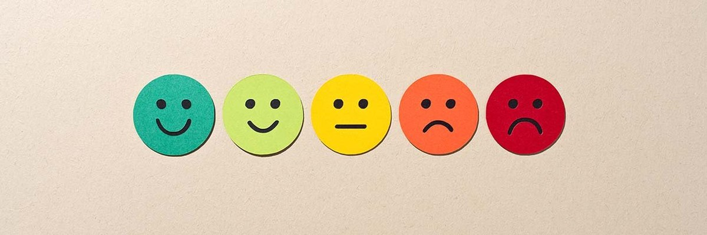
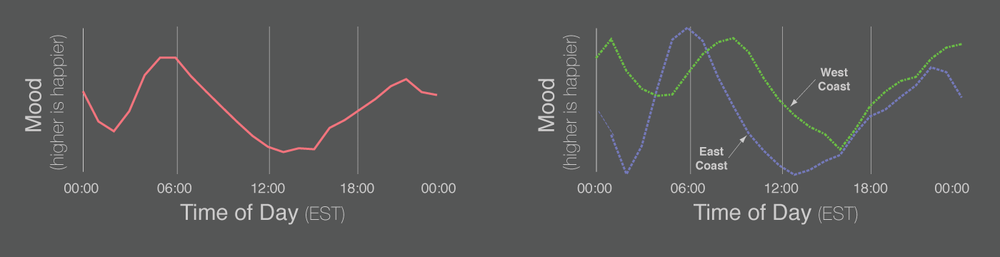
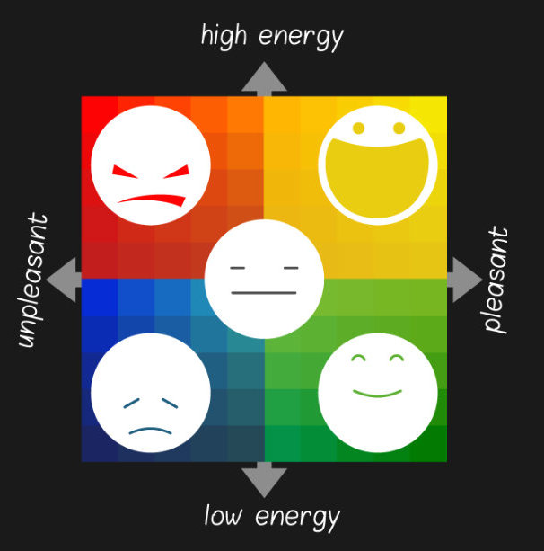

# Final Project Idea: You Are Not Alone

## Overview

### The Problem

At the University of Hawaiʻi at Mānoa, many students, faculty, and staff struggle silently with emotional stress, anxiety, burnout, and loneliness. There is no existing platform that enables the campus community to reflect on or share their emotional state throughout the day in a way that provides useful, anonymous insights for themselves and others. Because of this, students often feel alone during challenging periods, and instructors and staff have little visibility into the emotional pulse of the community.

### The Solution

**You Are Not Alone** is a mood-tracking and analytics web application tailored for the UH Mānoa community. Users can anonymously log their mood throughout the day via a simple form (rating 0–100 + emotion tags and cause), contributing to a campus-wide visualization of stress, happiness, and energy levels.

The application focuses on building user empathy and emotional resilience, with features that emphasize **“you are not alone”** showing how many other students feel similarly. The site also introduces personalized gamification through features like a pet blob that grows based on usage, mood-responsive themes (the colors change based on your mood), and collectible “cognitive cards” offering mood-based suggestions.

## Names of the Proposers

- Shade
- Cassandra
- Jyrum
- Kevin
- Sydney
- Mishalyn

## Mockup Page Ideas

### 1. **Mood Input Page**
- Slider from 0 to 100 for stress/mood level
- Radio buttons or emoji-based selector for emotional state (Happy, Sad, Angry, Calm, etc.)
- Text input for optional cause (e.g., “Exam coming up”, “Slept well”, “Argument with partner”)
- Submit button

### 2. **Dashboard (Global Stats)**
- Line graph showing aggregated mood trends based on time
- Filter options (by major, age, college, time of day)
- Summary text: “You are not alone. 87 students feel the same way today.”
- Heatmap of UH campus showing average mood per location (Localized Mood Zones)

### 3. **My Garden / Pet Blob Page**
- Visual representation of user’s emotional streak (growing plant or evolving blob)
- Daily mood history (list or calendar)
- “Cognitive Cards” that are collectibles earned from logging moods
- Weekly Recap: Best day, worst day, mood streaks

### 4. **Achievement Page**
- Hidden achievements unlocked by behavior or streaks
- Example: “Logged your mood during midterms week”, “Reached 7-day streak”, “Logged 10 positive moods in a row”

## Use Case Ideas

- **Student logs mood after an exam:** Sees they’re one of 120 others feeling anxious and receives a cognitive card recommending a brief breathing exercise.
- **Instructor checks aggregate mood at 7am class time:** Finds consistent low energy and considers adjusting pace or structure.
- **Student keeps logging moods over the semester:** Their pet blob grows, and their garden reflects their journey. At semester’s end, they receive a recap of emotional highlights.
- **Club leader sees high stress in their members before a major event:** Uses the info to reschedule or offer support.

## Beyond the Basics

### Special Sauce
- Every user has a unique evolving state:
  - Personalized “Pet Blob” or “Mood Grove”
  - Weekly recap and mood streaks
  - Responsive UI themes based on mood
  - Cognitive card collection system

### Serves the UH Mānoa Community
- Exclusively designed for UH Mānoa affiliates
- Based on a problem many UH students face
- Data collected is useful for both students and faculty
- Potential integration with student orgs or mental health campaigns

## Closing Notes
This project can serve teachers and students, allowing it to be a versatile website for serious use by students and instructors. We believe every student and teacher would find the timeline of data to be insightful to the University's dynamics while also giving insightful mental health tips to those that need it in an engaging manner.
