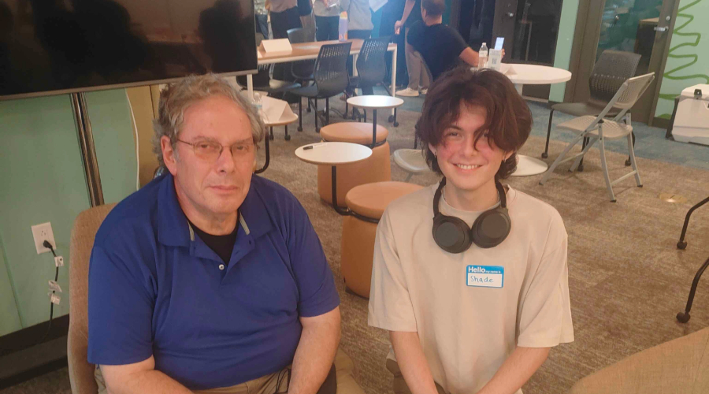

## An Eye-Opening Experience at Tech Minds Meetup

The **Tech Minds Meetup** was an incredible opportunity to connect with seasoned professionals in the tech industry. Held at **Pace**, the event brought together aspiring students and experienced engineers, fostering insightful discussions about career paths, industry challenges, and the skills necessary to thrive in the field. Over the course of the event, I engaged with multiple professionals at different tables, but one conversation that stood out was with **Sam Lipson**, a Broadband Engineer dedicated to bringing internet access to the residents of Molokai, who currently lack reliable connectivity.

## Learning from a Broadband Engineer

Sam's expertise spans both **hardware and software**, making his insights particularly valuable. He shared that while his current work is deeply rooted in hardware, his early experiences in software development played a crucial role in shaping his career. One of the most significant lessons he imparted was the importance of **team collaboration**. According to him, a well-functioning team is greater than the sum of its parts, and fostering open communication is key to success.

Another eye-opening point he made was about **marketing**—a skill that many engineers overlook. No matter how groundbreaking a product is, if it isn’t marketed effectively, it will struggle to gain traction. He emphasized the need to gather feedback from external perspectives to ensure that a project aligns with user expectations and investor interests. This lesson struck a chord with me, as I often focus on the technical side of projects without considering their broader impact.

## Balancing Perfectionism and Efficiency

We also discussed a personal challenge of mine: **perfectionism**. I tend to spend an excessive amount of time refining assignments, often getting lost in minor details. Sam advised me to channel this tendency toward solving real-world problems where time constraints naturally force efficiency. When working on projects with real users relying on timely solutions, the focus shifts from making something "perfect" to making something **effective**. He reminded me that small refinements should never come at the cost of overall progress—sometimes, an extra hour spent tweaking an already solid project is not worth it.

## Takeaways and Future Aspirations

This experience at Tech Minds Meetup reinforced the idea that a career in tech extends far beyond coding. It involves **problem-solving, teamwork, adaptability, and strategic communication**. Hearing these insights firsthand from professionals like Sam Lipson broadened my perspective on what it truly means to build impactful technology. Moving forward, I plan to apply these lessons by refining my collaboration skills, staying open to feedback, and learning how to present my work effectively to different audiences.

Attending this event was a valuable step toward my future in tech, and I look forward to more opportunities to engage with industry experts and continue learning.

*This essay was grammar-checked with ChatGPT.*

