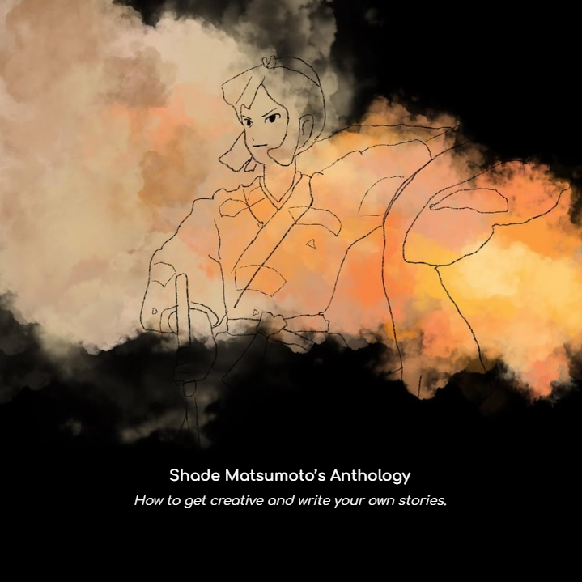

This anthology is a blend of introspection and storytelling, with each piece representing a step toward understanding deeper truths about the author’s identity and relationships. Themes of memory, pride, solitude, and the search for meaning are woven throughout, all while acknowledging the process of letting go and finding strength in the shadows.

The anthology begins with a literary mission statement that sets the stage for my exploration of self-expression through writing. The project culminates in a resolution that reflects a journey from reliance on external influences (symbolized by "Sky") to finding personal strength and understanding. Through this process, the writer’s skills as a storyteller and their ability to reflect on complex emotional experiences are fully realized.

This collection is a testament to my evolution as a writer—learning to shape my own narratives, confront my past, and move forward with clarity and purpose.

Here is an excerpt from the anthology:

*So, here is my conclusion, my resolution: I am Shade, no longer chasing light but embracing the twilight, where the past meets the present, and the unknown beckons. I carry my own strength, my own stories, and my own hope. Sky, thank you for the light, for the lessons, and for showing me what it means to be me. You were the sun that set my journey in motion, and I was the moon, reflecting your glow. Now, the sun has risen elsewhere, and I walk beneath the stars.*

*And as I step forward, I will keep writing, not to find you, nor to define myself against you. I will write because this is who I am. It is how I shine.*

PDF of work: <a href="https://drive.google.com/file/d/1l1gKiwOryMpdj_GY0aBCNQYb2KaOXlH0/view?usp=sharing"><i class="large github icon "></i>Shade Matsumoto's Anthology</a>
