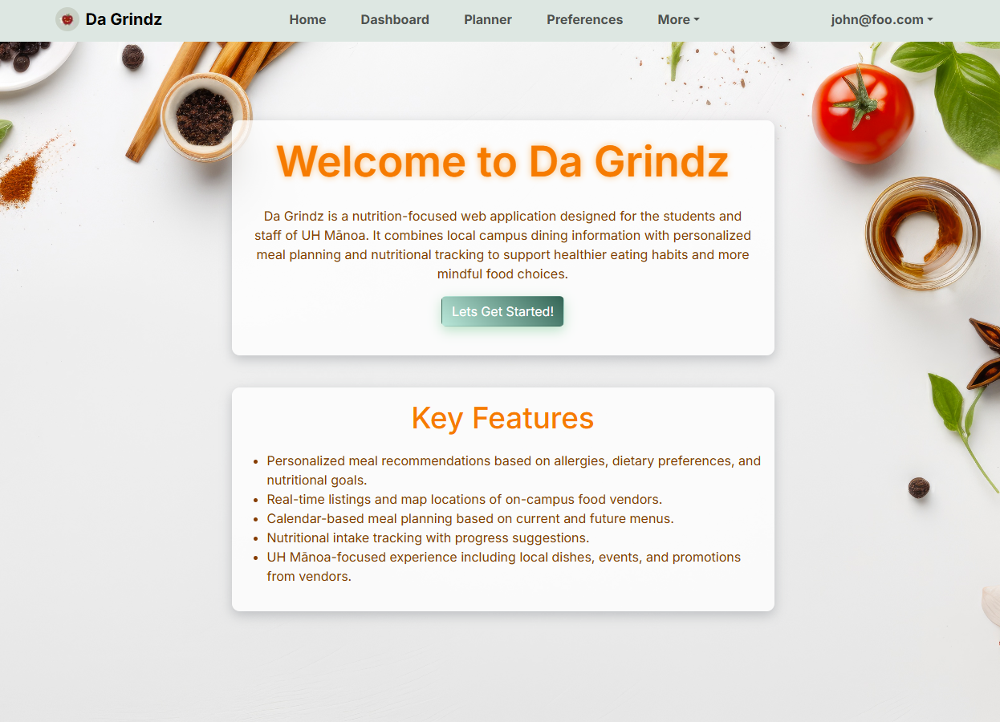
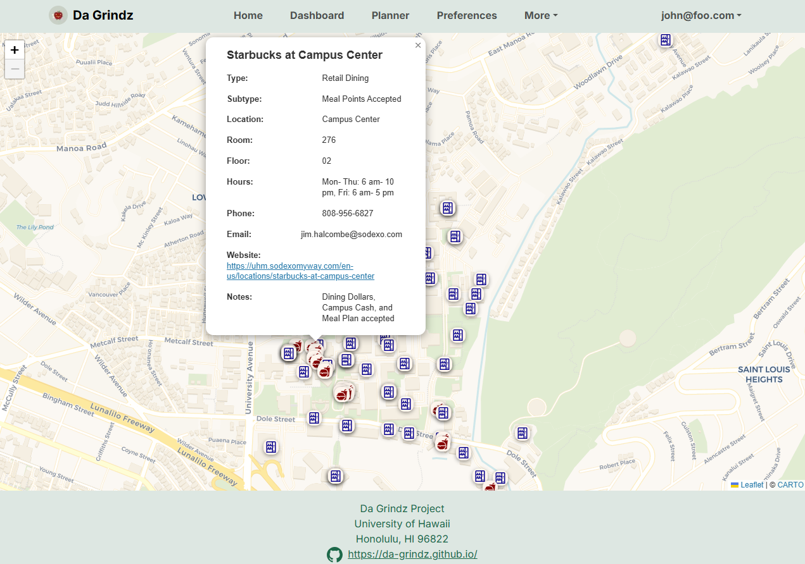

**Da Grindz** is a nutrition-focused web app built by our seven-person UH Mānoa capstone team. The site helps students and staff discover healthier meals on campus by pairing an interactive vendor map with personalized meal-planning and “Grindz Mood” recommendations. We delivered the app over three milestones, deploying each iteration with a Next.js + TypeScript front-end, and PostgreSQL back end.

My primary responsibility was to make sure the rest of the team never had to wonder, *“Where’s the food data?”* so I owned both the campus map and the initial import of every eatery, café, and vending machine. Early in Milestone 1 I gathered operating hours, names, locations, and payment details from multiple vendors, normalized them into a single default JSON data file, and configured the program to seed our PostgreSQL database. With that data in place, I integrated the map component, placing accurate pins across the UH Mānoa campus and connecting each marker to our central vendor records. Because the map went live in the very first release, my teammates could immediately plug real vendor objects into the dashboard, planner, and nutrition-tracking features instead of waiting for mock data.

Cleaning and importing the data was less straightforward than it sounds. Availability hours were in three different formats, vendor names were inconsistent, and vending machines rarely publish schedules at all. On the map side, performance mattered: the default view shows dozens of markers at once, so I deferred some rendering work to keep page loads smooth on older phones.

The payoff was tangible. During usability tests, several classmates specifically mentioned how helpful it was to “see every place to eat in one spot.” Internally, having a stable, queryable vendor schema unblocked the rest of the team: the planner used my hours data to suggest meals, the nutrition module tied macros to each menu item, and the “Grindz Mood” feature filtered vendors by the tags I attached up front.