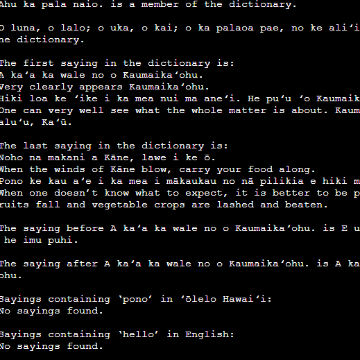

The ʻŌlelo Dictionary Project is a Java-based implementation of a dictionary designed for the ICS 311 class. It stores Hawaiian sayings alongside their English translations, utilizing a Red-Black Tree data structure to efficiently manage and search entries based on either Hawaiian or English content. This ensures quick access to sayings, their meanings, and allows users to find entries before or after a given term in the dictionary.

Beyond basic search functionality, the dictionary includes specialized methods to search for sayings containing specific Hawaiian words or English keywords, enhancing usability for those exploring the language. This project not only demonstrates the application of advanced data structures to optimize performance but also serves as a meaningful tool for learning about Hawaiian culture and language.

For this project, I collaborated with a partner. My primary responsibility was developing the entire source code, ensuring it was clear, well-structured, and easy to understand so my partner could effectively reflect on and explain the program in the accompanying essay. To achieve this, I maintained clean code organization, used descriptive variable names, and structured the project in a way that made it easy to follow. Our collaboration was seamless, requiring only a final review to ensure both the implementation and documentation were polished and ready for submission.

Source: [Olelo Dictionary](https://github.com/shadematsumoto/Olelo-Dictionary)
