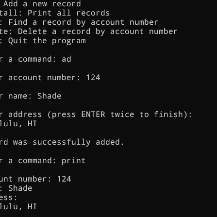

<div class="text-center p-4">
  
</div>

The Bank Database Management System is a C++ program designed to manage bank records through a user-friendly interface for ICS 212. It uses a linked list data structure to store and manipulate customer account data, including account numbers, names, and addresses. The system offers an interactive menu that allows users to add new records, print all records, find a specific record by account number, or delete a record from the database.

This program has practical use of linked lists in C++ for managing dynamic data, with additional functionality for reading from and writing to a file to preserve records between sessions. The user interface guides the user through data entry and ensures proper input validation. The system can be extended for further functionality, such as updating records or adding more complex data management features.

Here is some code that shows an integral function to read and translate the account number:

```cpp
void getAccountNum(int &uaccountno)
{
    cout << "\nEnter account number: ";

    cin >> uaccountno;
    while (cin.fail() || uaccountno <= 0)
    {
        cin.clear();
        cin.ignore(10000, '\n'); /* Clear buffer */
        cout << "Invalid input. Please enter a positive integer: ";
        cin >> uaccountno;
    }
    cin.ignore(10000, '\n'); /* Clear buffer */
}
```

You can view the document source code of the project [here](https://docs.google.com/document/d/15agaGHag4TF66nvZ1ZafPZ7zyoVoPZS2BSuHCRwvMm0/edit?usp=sharing).
